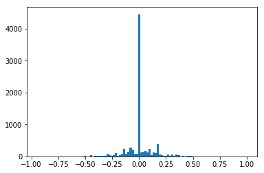
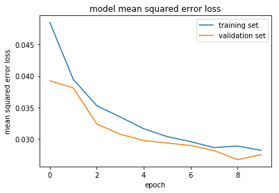

# Behavioral Cloning

## Learning to steer a car

This project presents a deep learning model that learns to steer a car inside the Udacity simulator based on a front camera. It can be generalized to any model, although the training data is only simulated data. The model is based on the NVidia end-to-end model, it takes in an image and outputs a steering angle.

An input image looks like:


## Method Description

---

#### Important files

The repository includes the following files:
* `model.py` containing the script to create and train the model
* `drive.py` for driving the car in autonomous mode
* `model.h5` containing a trained convolution neural network
* `README.md` summarizing the results

#### Running the model
Using the Udacity provided simulator and the `drive.py` file, the car can be driven autonomously around the track by executing
```sh
python drive.py model.h5
```

The neural network architecture is inside of the `model.py` and inside of the `Explory.ipynb` Jupyter Notebook. To *train* the model, just run `python model.py` and it will produce a `model.h5` file, which includes all the model weights and parameters.

#### Submission code is usable and readable

The `model.py` file contains the code for training and saving the convolution neural network. It includes the preprocessing of the image files, the model and training.

### Model Architecture and Training Strategy

#### Model summary

The Keras model is based on the NVidia end-to-end model, it is composed of a normalization layer, 5 convolution layers and 4 fully connected layers.

The model includes *ELU* layers to introduce nonlinearity, and the data is normalized in the model using a Keras lambda layer. It also includes a *Dropout* layer to reduce overfitting.


#### Training Strategy

Initially, the model performed very poorly, overfitting the training data. Given that the steering angle distribution in the data has a big bias towards near 0 angles (which makes sense given that in most of the frames the road is straight). So multiple methods to augment the data were employed, including:
1. Transforming the image
2. Adding brightness and shadow
3. Flipping the image
4. Using the center, left and right camera images
5. Cropped and resized the image

I recorded new data to make the model run smoothly. The data included:
- 3 laps of normal driving
- 2 laps of driving smoothly in curves
- 1 lap going in the other direction

I stumbled into multiple bugs, the one that took me a long time to figure out was using different color encodings in the `drive.py` and in the `model.py` training. After fixing all of these, the model started to perform much better.



Given that most of the track is near straight, adding the two laps of driving just around curves helped make the steering angle distribution appear more like a normal distribution.


In the following graph you can verify the performance of the initial model.


The final model had the following training, validation loss performance:



#### Model parameter tuning

The model used an *Adam optimizer*, so the learning rate was not tuned manually (model.py line 25).

During the preprocessing phase, there are various important parameters that can change the performance of the model. I found that the most important parameters were:
- Number of epochs
- Manipulating the near 0 steering angle distribution

The number of epochs I used started at 10, then in each iteration I only did 5 epochs. An iteration in this context was using the best performing model, and building upon it.

To evaluate the performance, I used the *means squared error*, given that we want to predict a number value.


#### Appropriate training data

Training data was chosen to keep the vehicle driving on the road. I used a combination of center lane driving, recovering from the left and right sides of the road. The data was also augmented, as mentioned before, so to make the dataset and model more robust. The final data used included:
- 3 laps of normal driving
- 2 laps of driving smoothly in curves
- 1 lap going in the other direction

For details about how I created the training data, see the next section.

### Model Architecture and Training Strategy

#### Solution Design Approach

The overall strategy for deriving a model architecture was to use the NVidia model as a starting point, and try out adding/removing layers. Basically it was a trial and error approach. The NVidia model seems appropriate for the problem given that it was used on a real world car, with real images that are considerably more feature rich compared to the simulated enviornment.

The data was initially split into training and validation sets. 10% of the data was set aside to validate the model, and verify that the model was not overfitting (I later changed it to 20% for validation set). I found that the first models had a low mean squared error on the training set but a relative high mean squared error on the validation set. This implied that the model was overfitting.

To combat the overfitting, I added *Dropout* layers to the model and removed a fully connected layer.

Then augmented the data, which seemed to be the most effective method. Adding more data and epochs was by far the best approach to improve the model.

The final step was to run the simulator to see how well the car was driving around track one. There were a few spots where the vehicle fell off the track, initially it fell off after the bridge in the first track. To improve the performance there, a sampling method was used in the data generator so as to reduce the data bias towards near 0 steering angles.

At the end of the process, the vehicle is able to drive autonomously around the track without leaving the road.

#### Final Model Architecture

The final model architecture consisted of a convolution neural network with the following layers and layer sizes:
- 1 normalization layer
- 5 convolution layers with a dropout layer between them
- 4 fully connected layers, with `ELU` activation functions
- 1 output layer fully connected that outputs a value

Here is a visualization of the architecture:


The video for the final model is:


#### Creation of the Training Set & Training Process

The dataset was composed of running the simulator on the first track and recording 3 laps of normal center lane driving, 2 laps of just recording the curves and 1 lap going in the reverse direction.

Here is an example of a center camera image:


To augment the data sat, I employed multiple methods, including flipping the image, adding brightness, adding shadow, and translating the image. This is the transformation for one image:


After the collection process, I had X number of data points. I then split the dataset into training and validation sets, with 90% used for training and 10% to validate.

I used a generator to feed the data to the model. The generator also served as a control sampling method so that the data was not oversampled by data points with near 0 steering angle.

I used this training data for training the model. The validation set helped determine if the model was over or under fitting. The ideal number of epochs was 10 as evidenced by testing out the model with more epochs and more training data. I used an adam optimizer so that manually training the learning rate wasn't necessary.


## Reference

> Vivek Yadavs Blogpost was referenced, specifically for the data transformation/augmentation helper functions
NVidias End-To-End paper was used to build the network
> The Comma AI network is based on their open source project.
